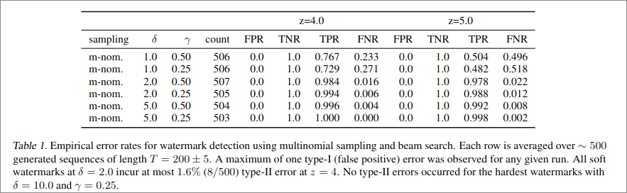
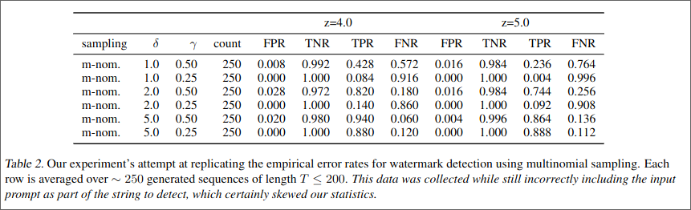
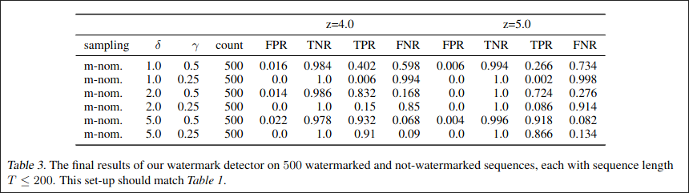

💧 **Watermarking for (L)LMS, Notebook Reimplementation** 🔍
===
- Sean Brynjólfsson $\small{\texttt{(smb459@cornell.edu)}}$
- Adler Weber $\small{\texttt{(amw369@cornell.edu)}}$
- Gurvir Singh $\small{\texttt{(gs557@cornell.edu)}}$

# Introduction

This project aims to reimplement the watermarking technique described in [*A Watermark for Large Language Models*](https://arxiv.org/abs/2301.10226) by John Kirchenbauer*, Jonas Geiping*, Yuxin Wen, Jonathan Katz, Ian Miers, and Tom Goldstein, which was published in ICML 2023.

In order to efficiently detect whether a slice of text was generated by a watermarked language model, the method maintains a "green list" of tokens, whose logits are inflated. The model is softly encouraged to output these tokens, and a statistical test can then efficiently detect whether this text was generated by model. This proves useful in preventing the prolification of generated spam and malicious content.

## *Project schedule*:

- [x] Week 1 (Mar 10 - Mar 17): **Project Setup and Data Acquisition**: Set up colab dev environment and secure datasets.
- [x] Week 2 (Mar 17 - Mar 24): **Implementation**
- [x] Week 3 (Mar 24 - Mar 31): **Implementation and Initial Testing**
- [x] Week 4 (Mar 31 - Apr 7):  **In-depth Evaluation**: Perform a thorough evaluation of watermarking effectiveness.
- [x] Week 5 (Apr 7 - Apr 14): **Fine-tuning and Report Writing**: Refine mechanism based on results from Week 4. Focus on robustness. Put some results onto paper.
- [x] Week 6 (Apr 14 - 21): **Report Writing and Presentation Creation**
- [x] Apr 30 - May 7: **In-Class Project Presentations**

# Re-implementation Details
Our implementation takes the form of a Jupyter Notebook (python) which is ready-to-use and uses only 3 libraries: torch, transformers, and tokenizers. These versioning dependencies are documented in [code/requirements.txt](./code/requirements.txt) but the notebook itself should already handle this for you. In the notebook, we also inline our newspaper title dataset (which can otherwise be found at [data/titles.txt](./data/titles.txt) in the repository; see data section under references). 

Running the notebook as-is should do the following:
1. Install necessary packages
2. Import necessary packages
3. Create helper methods for visualization
4. Define the Watermarker and Detector classes.
5. Create prompts from inlined newspaper titles.
6. Initialize the generator (phi-2)

The default prompt we submit to the model is "Write an article about (article title)" and we query the model to generate around 200 tokens of output (not including the prompt). Running the notebook as-is should begin to run batches of these prompts over the experiment configurations (variations over $\gamma, \delta, z$) listed in the paper. 

Here we briefly explain the liberties we took in our implementation that differ from the author's specifications.
* The original authors hash the partition of the red and green-listed words with a short context window. 
    * This concern is primarily cryptographic when using multinomial generation, but for beam search (which is out-of-scope for our implementation) this plays a larger role in preserving model perplexity. 
    * This decision becomes more consequential if the model used for generation tends to repeat tokens (or n-grams). Some tokens are repeated often (i.e. punctuation, words like 'the', 'an', 'is'), but we believe this is of little consequence qualitatively.
* The original authors use OPT-6.7B for their generator model, we use Microsoft's Phi-2 model since it is much smaller and can fit on a Colab notebook VM. 
    * We noticed that Phi-2 is heavily fine-tuned on code. Even when no prompt related to code generation is provided, it may start to blurt out code or interpret the prompt as a coding task when it is not. Certain outputs (like regular expressions) repeat tokens often, and this leads to some degenerate cases (these are rare events but they do happen).
* The original authors use a sequence length of $T=200\pm5$ for their evaluation--we could not find a way to easily recreate this range and instead attempted to use max_length=$205$ and min_length=$195$ as part of the HuggingFace generate interface. Unfortunately, the model seems to disobey these bounds occasionally but produces sequences that are usually within a tenth-order of magnitude.
* We felt the masked-regeneration-comparison objective was an unnecessary procedure to follow for the experiment. We saw the potential to get identical results by having our model generate two sequences (one watermarked, the other not watermarked) and then see if the detector could disambiguate them.

# Results and Analysis

## Original Paper's Results
The table below titled *Table 1* comes from *Table 2* of the original arXiv paper. This table summarizes the empirical results the authors achieved when evaluating their watermarking technique and detector. They targeted the domain related to news articles since their primary concerns in the paper were how (L)LMs can be used to automate disinformation and other mal-purposes of language. To do so, they used real news articles and masked out a ~200 token sequence of words to generate with the context of the preceding article. They then compared the human written article to the generated (watermarked) article under their detector. 

## Our Results
Below is the result of our first experiment where we tested each experiment configuration for 250 prompts. NOTE: At this point, we had not realized that the input prompt (usually around ~40 tokens) was being included with the generated text for the discriminator.

After we cutting out the prompt from the output, we hypothesized that this would align with the original experiment's setup since the main difference we saw was noise and an extreme sensitivity to $\gamma$, which aligned with our hypothesis that the skewed results were due to this constant portion of prompt text which the model had no control of generating. 

We verified the inputs to the detector and saw that these were correct over the various configurations of the watermark parameters. Visually, the watermarks look as expected. We then ran on 500 prompts (which takes 24 hours without batching prompts) and the below table summarizes these results. 

Unfortunately, these results are nearly identical to the faulty 250 run previously, even with the inputs and outputs fixed.

# Conclusion and Future Work

[TODO]()
[TODO]()
[TODO]()
[TODO]()
[TODO]()

# References
## Project links:
1. [Original LM-Watermarking Github Repository](https://github.com/jwkirchenbauer/lm-watermarking/tree/main)
2. [LM-Watermarking Arxiv Paper](https://arxiv.org/abs/2301.10226)
## Data
See the [data folder](./data).

# Progress Logs

## [TODO: Finish 1-2 more progress logs below]()
[TODO]()
[TODO]()
[TODO]()
[TODO]()
[TODO]()

### [Apr.13]: (**SEAN**) Right now the implementation is *incredibly* messy but does (did...) watermark.
* Implemented minimal version of everything (on CPU, haven't tested GPU)
  * Watermarker can participate in a HF text generation pipeline and nudge logits
    * The watermarking might increases inference time by a LOT! Not sure what caused this but on the regular env I had to terminate Phi-2 after 30 minutes.
    * Switching to a T4 runtime (even though still using CPU) dropped this to around 1-2 minutes; so I guess CPU matters!
  * Detector can output detected tokens based on its greenlist (currently taken directly from the generator but we can decide if we want to find this from the generator instead).
  * Generator. Currently using Phi-2 since it barely fits on the free env.
    * Actually using Phi-2 might be a bad choice depending on what 'greedy' and 'beam search' mean---I haven't actually looked into these or the model yet.
* Removed input-seeding; the authors use a random seed based on a hash of the input text, this allows for the detector to figure out the greenlist_ids from the model without having access to the model.
  * In place of this, the detector copies over the greenlist_ids of the generator.

### [Mar.22]: (**SEAN**) Set up the skeleton and initial TODOs.
* Created/built Colab environment
* Set up notebook cells with links/timeline/details/etc.
* Derived simplified interface to implement modeled on the paper
